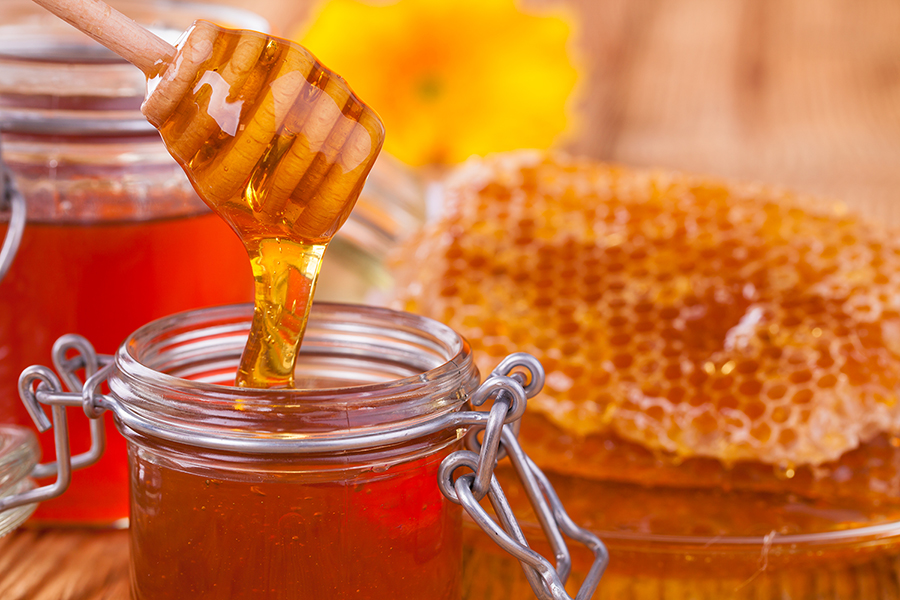

# Honey Purity Prediction

## Project Domain: Agriculture and Food Science

This repository contains the dataset used and code for predicting the purity of honey samples using machine learning and deep learning models.

## Overview
The Honey Purity Prediction project leverages machine learning and deep learning techniques to determine the purity of honey based on various input features such as color score, density, water content, pH level, and more. The objective is to develop reliable predictive models that effectively capture the complex factors influencing honey quality.

## Features
#### Data Processing:
- Includes data cleaning, and feature engineering steps.
#### Model Training:
- Implements and trains multiple machine learning and deep learning models to predict honey purity.
#### Hyperparameter Tunning:
- The model parameters are refined through the training process. Pass data through the model's operations, evaluate the accuracy, and make adjustments to achieve optimal values.
#### Model Evaluation:
- Evaluates model performance using metrics such as accuracy.
#### Deployment:
- Provides a Streamlit app for interactive predictions and visualization.

## Models Used
The following machine-learning and depp-learning models are employed in this project:

- Linear Regression
- Lasso Regression
- Decision Tree
- Random Forest
- Gradient Boosting
- XGBoost
- AdaBoost
- GridSearchCV Lasso
- GridSearchCV XGBoost
- ANN
- RNN

## Interact with the App
- Data: Provided the necessary honey data for prediction.
- Model Selection: Choose from various trained models.
- View Results: Get predictions and view model performance metrics.